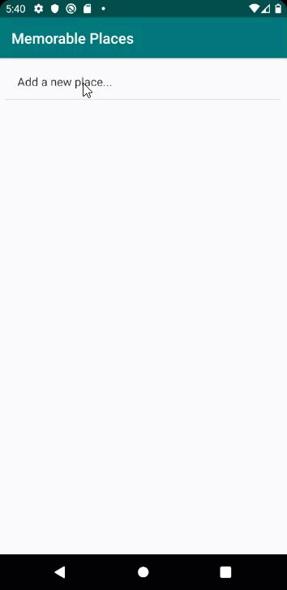

# Android App: Using Java

## Repository for my Memorable Places app



Find out how to build a simple Memorable Places app. Author Melvin Kisten tackles location, permissions, ByteArrayInputStream, ByteArrayOutputStream, ObjectInputStream, ObjectOutputStream, Serializable, Intent, SharedPreferences, GoogleMap classes and APIs. 

## Instructions
1. Make sure you have these installed
	- [Android Studio](https://developer.android.com/studio#downloads "Android Studio")

2. Clone this repository into your local machine using the terminal (mac) or [Gitbash (PC)](https://git-scm.com/download/win "Gitbash (PC)")
	
	`> git clone https://github.com/iammelvink/memorable-places.git`
3. Vist [Google Cloud Platform Console](https://cloud.google.com/console/google/maps-apis/overview "Google Cloud Platform Console") and Sign Up or Sign In if you already have an account 

4. Copy your API key from [Google Cloud Platform Console](https://cloud.google.com/console/google/maps-apis/overview "Google Cloud Platform Console") and paste at file : 
	`app\src\main\AndroidManifest.xml` at the line where you see this `YOUR_API_KEY`:

	```xml
	<meta-data
        android:name="com.google.android.geo.API_KEY"
        android:value="YOUR_API_KEY" />
	```
	And paste at file:
	`app\src\debug\res\values\google_maps_api.xml` at the line where you see this `YOUR_API_KEY`:

	```xml
	<string name="google_maps_key" templateMergeStrategy="preserve" translatable="false">YOUR_API_KEY</string>
	```
5. Run Android Studio and choose Open an existing Android Sudio project
6. Press play button to run the app 

## More Stuff
Check out some of my other stuff on [WiiLearnTech](https://www.wiilearntech.com "WiiLearnTech Website"). Follow me on [Twitter](https://twitter.com/iammelvink "iammelvink") and [Instagram](https://www.instagram.com/iammelvink "iammelvink"), or check out my [YouTube channel](https://www.youtube.com/channel/UCwMGEkyU2QOqEEKJ1E5pe7w "WiiLearnTech YouTube").